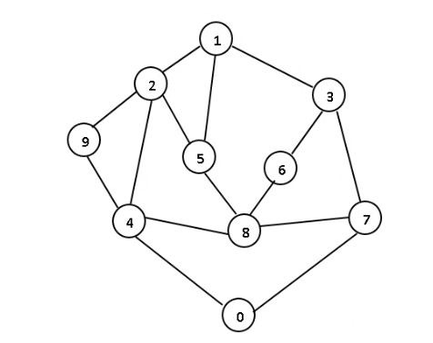

# graph-program



## Graph Adjacency Matrix

```
    0 1 2 3 4 5 6 7 8 9
0   0 0 0 0 1 0 0 1 0 0
1   0 0 1 1 0 1 0 0 0 0
2   0 1 0 0 1 1 0 0 0 1
3   0 1 0 0 0 0 1 1 0 0
4   1 0 1 0 0 0 0 0 1 1
5   0 1 1 0 0 0 0 0 1 0
6   0 0 0 1 0 0 0 0 1 0
7   1 0 0 1 0 0 0 0 1 0
8   0 0 0 0 1 1 1 1 0 0
9   0 0 1 0 1 0 0 0 0 0
```

## Graph Adjacency Linked List

```
            (0001)        (0008)
0   0001    (4, 0008) ->  (7, null)

            (0010)        (0014)        (0018)
1   0010    (2, 0014) ->  (3, 0018) ->  (5, null)

            (0020)        (0024)        (0026)        (0028)
2   0020    (1, 0024) ->  (4, 0026) ->  (5, 0028) ->  (9, null)

            (0030)        (0034)        (0038)
3   0030    (1, 0034) ->  (6, 0038) ->  (7, null)

            (0040)        (0044)        (0046)        (0048)
4   0040    (0, 0044) ->  (2, 0046) ->  (8, 0048) ->  (9, null)

            (0050)        (0054)        (0058)
5   0050    (1, 0054) ->  (2, 0058) ->  (8, null)

            (0060)        (0068)
6   0060    (3, 0068) ->  (8, null)

            (0070)        (0074)        (0078)
7   0070    (0, 0074) ->  (3, 0078) ->  (8, null)

            (0080)        (0084)        (0086)        (0088)
8   0080    (4, 0084) ->  (5, 0086) ->  (6, 0088) ->  (7, null)

            (0090)        (0098)
9   0090    (2, 0098) ->  (4, null)
```